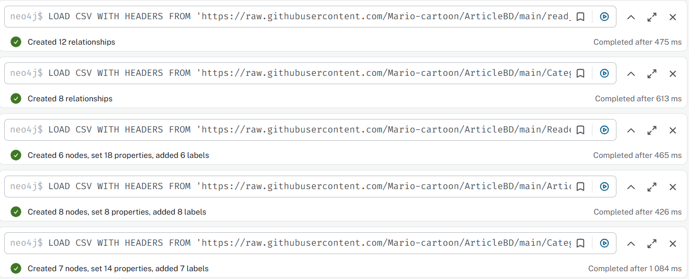
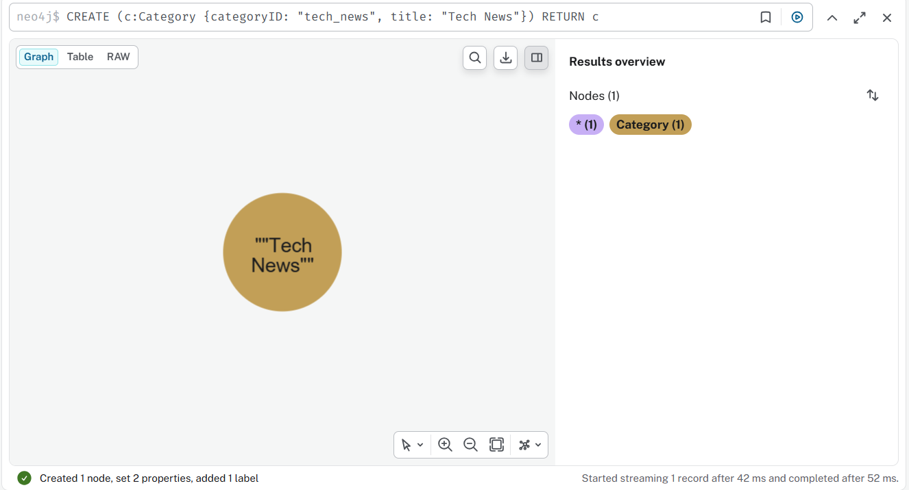
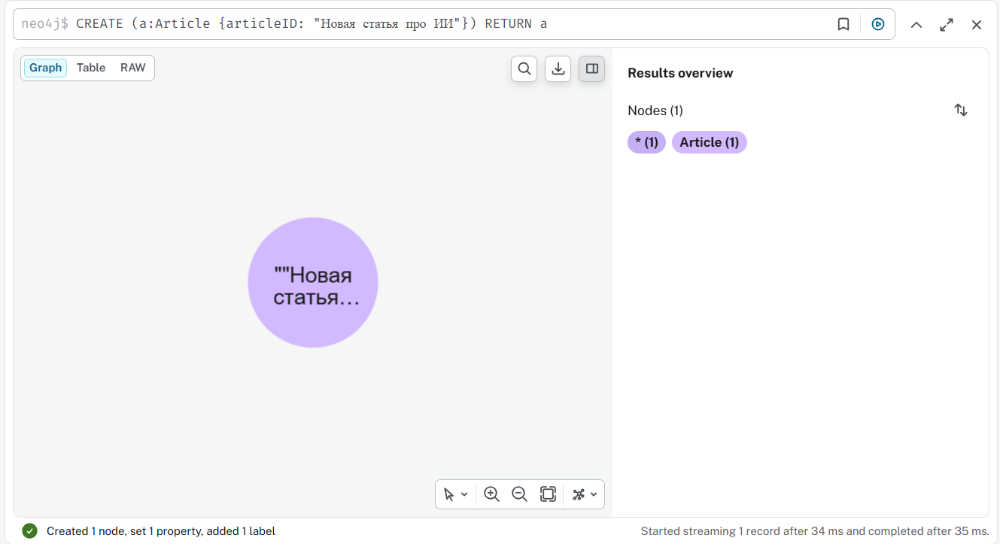
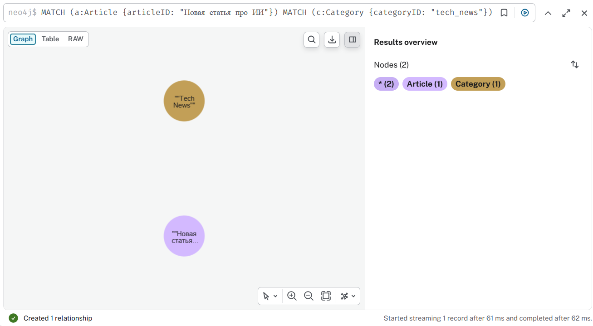
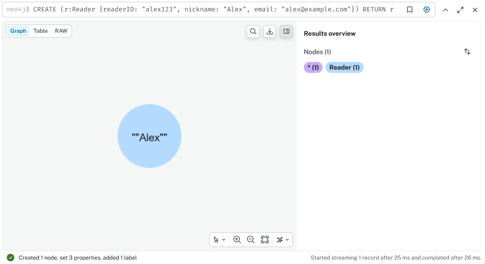
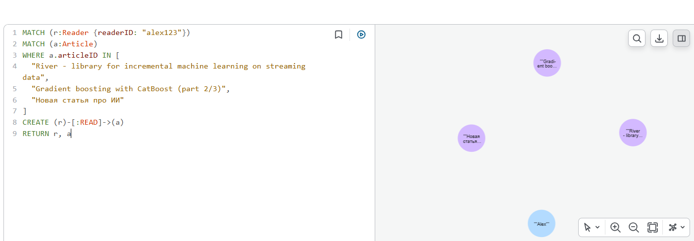
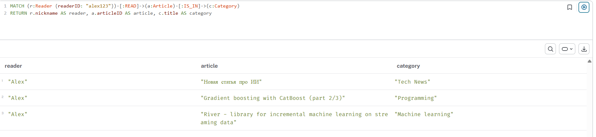
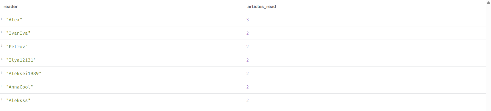
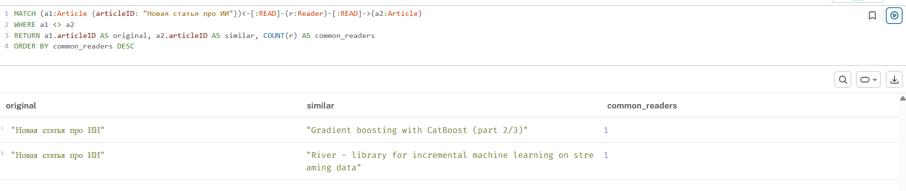

импорт

добавление категории

добавление статьи

добавление связи

связываение читателя с новостями

все пользователи, статьи и связи между ними

пользователь и категории, которые он читает

самые активные читатели

статья и похожие статьи

